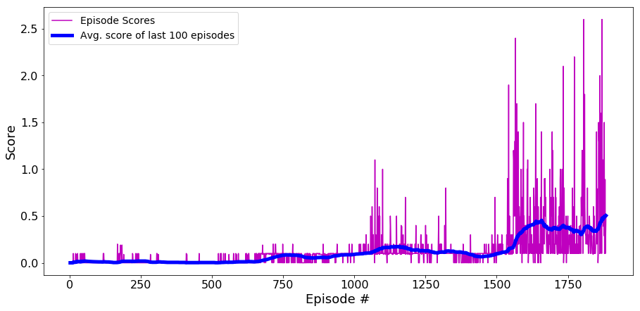

# Project Report

## Learning algorithm

The learning algorithm used is Multi Agent Deep Deterministic Policy Gradient. 
In this architecture, the main agent (call it meta agent or containing agent) MADDPG is itself implemented as consisting of 2 DDPG based agents - each representing a tennis player. The training code contained in Tennis.ipynb instantiates and interacts with MADDPG agent. The 2 contained agents use DDPG algorithm and themseves are implemented as adversarial networks; consisting of own actor (policy) and critic (Value) networks. Actor(policy) component of each agent receives its own observation and outputs 2-D action. The critic (Value) component of each agent receives observations and actions of all actors i.e each agents' critic is enhanced with extra information from every other agent's policy.

During training the agents also use a common experience replay buffer (a set of stored previous 1-step experiences) and draw independent samples.

### Neural networks

Basic network architecture consists of 2 fully connected hidden layers using ReLU activations for both actor (policy) and critic (value). Each hidden layer is made up of 256 nodes. One batch normalization layer in the architecture for all actor and all critic models. Batch Normalization allows us to use much higher learning rates and be less careful about initialization It also acts as a regularizer, in some cases eliminating the need for Dropout (as in our implementation) as described in Batch Normalization: Accelerating Deep Network Training by Reducing Internal Covariate Shift(https://arxiv.org/abs/1502.03167)

## Parameters and hyperparameters

After a variety of experimentations, following hyperparameters were chosen :
Actor Learning Rate = 1e-4,
Critic Learning Rate =1 e-3,
Optimiser = Adam Optimiser,
Tau = 1e-3,
Initial noise amt = 1.0,
noise_decay=1.0,
t_stop_noise=30000 (Overall number of timesteps i.e including all episodes till which initial noise is held constant)
batch size = 256,
buffer size = 10000
weight decay = 0


## Results


```
Environment solved in 1884 episodes!	Average Score: 0.504
```

and learned weights are  saved as `checkpoint_critic_agent_1.pth`, `checkpoint_actor_agent_1.pth'`,  `checkpoint_critic_agent_0.pth`,`checkpoint_actor_agent_0.pth` 

## Next steps

- **Hyperparameter tuning** - I focused on tuning hidden size and gradient clip which gave major improvements. Other parameters would probably impact learning and it's worth to check how.
- **PPO** -  Will try changing the model for agents to PPO to see how it affects the training performance.
- **Priortized experience replay** - Experience replay is an important aspect for stablising the training. Will try Priortized experience replay.
- **Noise Element** - Will try out gradual reduction to noise rathern than stopping it altogether after some episodes).

## Result Image



